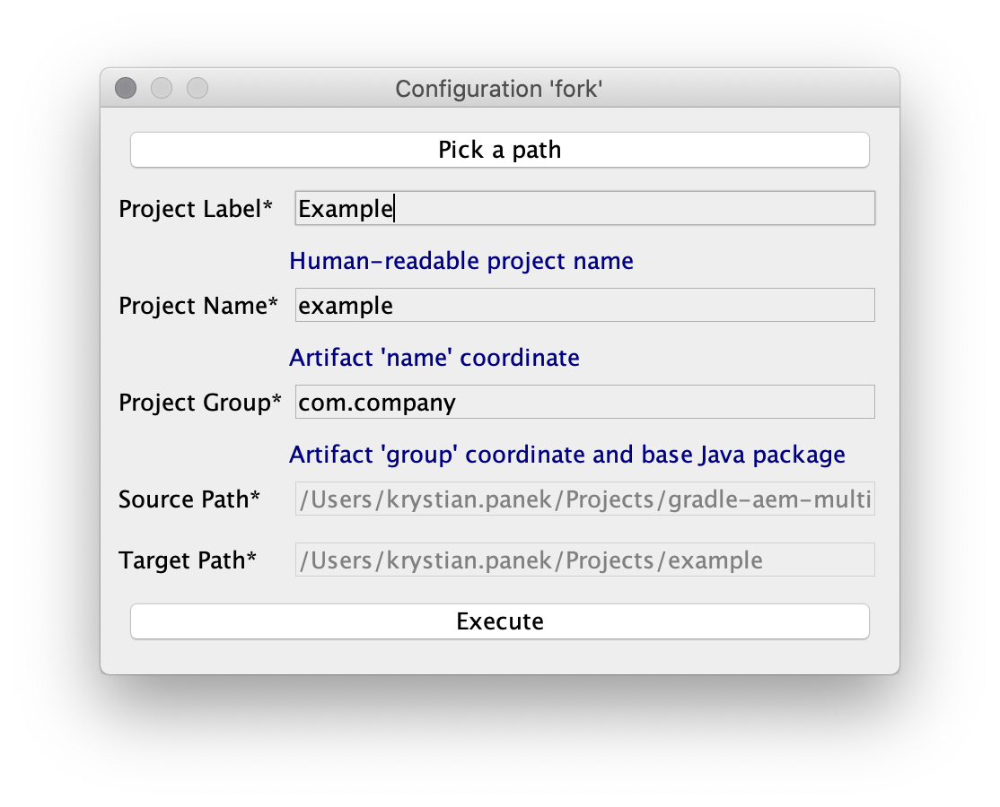

[](https://gradleupdate.appspot.com/Cognifide/gradle-aem-multi/status)
[](http://www.apache.org/licenses/)

# AEM Multi-Project Example

<br>
<p align="center">
  
</p>
<br>


## Description

This project could be used to start developing **project** based on AEM.

To start developing **application** based on AEM it is recommended to use [Gradle AEM Single](https://github.com/Cognifide/gradle-aem-single) instead.

Documentation for AEM plugin is available in project [Gradle AEM Plugin](https://github.com/Cognifide/gradle-aem-plugin).

## Important notice 

Gradle AEM Plugin 6.x serie and upper will **no longer support Groovy DSL** and **stands on Kotlin DSL** coming with Gradle 5.0.

Documentation for:

* [migrating Groovy DSL to Kotlin DSL](https://guides.gradle.org/migrating-build-logic-from-groovy-to-kotlin) (official Gradle docs).
* [previous 5.x serie](https://github.com/Cognifide/gradle-aem-multi/tree/groovy) (navigates to branch `groovy`),

## Table of Contents

* [Quickstart](#quickstart)
* [Environment](#environment)
* [Structure](#structure)
* [Features](#features)
* [Building](#building)
* [Tips &amp; tricks](#tips--tricks)
* [Running tests](#running-tests)
* [Attaching debugger](#attaching-debugger)
* [Extending build](#extending-build)

## Quickstart

1. Fork project using command:

    ```bash
    git clone git@github.com:Cognifide/gradle-aem-multi.git && cd gradle-aem-multi && gradlew fork
    ```

    and specify properties:

    
    
    and wait until project is forked then enter configured target directory.

2. Setup user specific project configuration using command:

    ```bash
    gradlew props
    ```
    
    and specify properties:

    

3. Setup local AEM instances and dependencies then build application using command:

    ```bash
    gradlew -i aemSetup
    ```
    
    and wait till complete AEM environment will be ready to use.
  
4. Develop continuously application using command:

    ```bash
    gradlew -i
    ```

## Environment

Tested on:

* Java 1.8
* Gradle 5.0
* Adobe AEM 6.4

## Structure

Project is divided into subpackages (designed with reinstallabilty on production environments in mind):

* *aem/full* - non-reinstallable complete all-in-one package with application and contents.
* *aem/app* - reinstallable assembly package that contains all sub-parts of application:
    * *common* - OSGi bundle with integrations of libraries needed by other bundles and AEM extensions (dialogs, form controls etc).
    * *core* - OSGi bundle with core business logic and AEM components implementation.
    * *config* - OSGi services configuration.
    * *design* - AEM design configuration responsible for look & feel of AEM pages.
* *aem/content* - non-reinstallable assembly package that contains all type of contents listed below:
    * *init* - contains all JCR content needed initially to rollout new site(s) using installed application.
    * *demo* - consists of extra AEM pages that presents features of application (useful for testing).

## Features

* Integrated [Fork Plugin](https://github.com/neva-dev/gradle-fork-plugin) / project generator based on live archetypes.
* Interoperable Java and [Kotlin](https://kotlinlang.org) code examples.
* Integrated popular UI build toolkit: [NodeJS](https://nodejs.org/en/), [Yarn](https://yarnpkg.com) and [Webpack](https://webpack.github.io/) for advanced assets bundling (modular JS, ECMAScript6 transpilation, SCSS compilation with [PostCSS](http://postcss.org), code style checks etc).
* Integrated SCSS compilation on AEM side using [AEM Sass Compiler](https://github.com/mickleroy/aem-sass-compiler).
* Integrated popular AEM testing toolkit: [wcm.io Testing](http://wcm.io/testing).
* Example configuration for embedding OSGi bundles into CRX package (`aemInstall`, `aemEmbed`).
* Example configuration for installing dependant CRX packages on AEM before application deployment (`aemSatisfy`).

## Building

1. Install Gradle
    * Use bundled wrapper (always use command `gradlew` instead of `gradle`). It will be downloaded automatically (recommended).
    * Use standalone from [here](https://docs.gradle.org/current/userguide/installation.html).
2. Run `gradlew idea` or `gradlew eclipse` to generate configuration for your favourite IDE.
3. Deploy application:
    * Full assembly, migration and all tests
        * `gradlew` <=> `:deploy`
    * Only assembly packages:
        * `gradlew :aem:assembly:full:aemDeploy`
        * `gradlew :aem:assembly:app:aemDeploy`
        * `gradlew :aem:assembly:content:aemDeploy`
    * Only single package:
        * `gradlew :aem:sites:aemDeploy`,
        * `gradlew :aem:common:aemDeploy`,
        * `gradlew :aem:migration:aemDeploy`,
        * `gradlew :aem:content.init:aemDeploy`,
        * `gradlew :aem:content.demo:aemDeploy`.

## Tips & tricks

* To run some task only for subproject, use project path as a prefix, for instance: `gradlew :aem:app.design:aemSync`.
* According to [recommendations](https://docs.gradle.org/current/userguide/gradle_daemon.html), Gradle daemon should be: 
    * enabled on development environments,
    * disabled on continuous integration environments.
* To see more descriptive errors or want to skip some tasks, see command line [documentation](https://docs.gradle.org/current/userguide/command_line_interface.html).

## Running tests 

### IntelliJ

Certain unit tests may depend on the results of running gradle tasks. One such example is the testing of OSGi Services using [OSGi Mocks](https://sling.apache.org/documentation/development/osgi-mock.html) where in order to run a test, the SCR metadata must be available for a class. Running a test like this in IntelliJ results in errors because the IDE is not aware of the Bundle plugin.

This can be worked around by configuring IntelliJ to delegate test execution to Gradle. In order to set this up, go to _Settings > Build, Execution, Deployment > Gradle > Runner_ and set your IDE to delegate IDE build/run actions to Gradle. Alternatively, you can use a dropdown menu to use a specific runner or to decide on a test-by-test basis.

## Attaching debugger

1. Execute build with options `-Dorg.gradle.debug=true --no-daemon`, it will suspend,
2. Attach debugger on port 5005,
3. Suspension will be released and build should stop at breakpoint.

## Extending build

For defining new tasks directly in build see:

 * [Build Script Basics](https://docs.gradle.org/current/userguide/tutorial_using_tasks.html)
 * [More about Tasks](https://docs.gradle.org/current/userguide/more_about_tasks.html)

The easiest way to implement custom plugins and use them in project is a technique related with _buildSrc/_ directory.
For more details please read [documentation](https://docs.gradle.org/current/userguide/organizing_build_logic.html#sec:build_sources).
