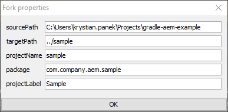
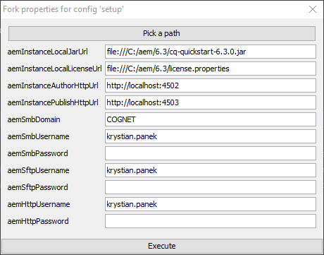

[](https://gradleupdate.appspot.com/Cognifide/gradle-aem-multi/status)
[](http://www.apache.org/licenses/)

# AEM Multi-Project Example

<br>
<p align="center">
  
</p>
<br>


## Description

This project could be used to start developing **project** based on AEM.

To start developing **application** based on AEM it is recommended to use [Gradle AEM Single](https://github.com/Cognifide/gradle-aem-single) instead.

Documentation for AEM plugin is available in project [Gradle AEM Plugin](https://github.com/Cognifide/gradle-aem-plugin).

## Table of Contents

* [Quickstart](#quickstart)
* [Environment](#environment)
* [Structure](#structure)
* [Features](#features)
* [Building](#building)
* [Tips &amp; tricks](#tips--tricks)
* [Attaching debugger](#attaching-debugger)
* [Extending build](#extending-build)

## Quickstart

1. Fork project using command:

    ```bash
    git clone git@github.com:Cognifide/gradle-aem-multi.git && cd gradle-aem-multi && gradlew -i fork
    ```

    and specify properties:

    
    
    and wait until project is forked then enter configured target directory.

2. Setup user specific project configuration using command:

    ```bash
    gradlew -i fork -Pfork.config=setup
    ```
    
    and specify properties:

    

3. Setup local AEM instances and dependencies then build application using command:

    ```bash
    gradlew -i aemSetup
    ```
    
    and wait till complete AEM environment will be ready to use.
  
4. Develop continuously application using command:

    ```bash
    gradlew -i
    ```

## Environment

Tested on:

* Java 1.8
* Gradle 4.4.1
* Adobe AEM 6.3

## Structure

Project is divided into subpackages (designed with reinstallabilty on production environments in mind):

* *root* - non-reinstallable complete all-in-one package with application and contents.
* *app* - reinstallable assembly package that contains all sub-parts of application:
    * *common* - OSGi bundle with integrations of libraries needed by other bundles and AEM extensions (dialogs, form controls etc).
    * *core* - OSGi bundle with core business logic and AEM components implementation.
    * *config* - OSGi services configuration.
    * *design* - AEM design configuration responsible for look & feel of AEM pages.
* *content* - non-reinstallable assembly package that contains all type of contents listed below:
    * *init* - contains all JCR content needed initially to rollout new site(s) using installed application.
    * *demo* - consists of extra AEM pages that presents features of application (useful for testing).

## Features

* Integrated [Fork Plugin](https://github.com/neva-dev/gradle-fork-plugin) / project generator based on live archetypes.
* Interoperable Java and [Kotlin](https://kotlinlang.org) code examples.
* Integrated popular UI build toolkit: [NodeJS](https://nodejs.org/en/), [Yarn](https://yarnpkg.com) and [Webpack](https://webpack.github.io/) for advanced assets bundling (modular JS, ECMAScript6 transpilation, SCSS compilation with [PostCSS](http://postcss.org), code style checks etc).
* Integrated SCSS compilation on AEM side using [AEM Sass Compiler](https://github.com/mickleroy/aem-sass-compiler).
* Integrated popular AEM testing toolkit: [wcm.io Testing](http://wcm.io/testing).
* Example configuration for embedding OSGi bundles into CRX package (`aemInstall`, `aemEmbed`).
* Example configuration for installing dependant CRX packages on AEM before application deployment (`aemSatisfy`).

## Building

1. Install Gradle
    * Use bundled wrapper (always use command `gradlew` instead of `gradle`). It will be downloaded automatically (recommended).
    * Use standalone from [here](https://docs.gradle.org/current/userguide/installation.html).
2. Run `gradlew idea` or `gradlew eclipse` to generate configuration for your favourite IDE.
3. Build application and deploy:
    * Assembly packages:
        * `gradlew` <=> `:aemSatisfy :aemDeploy :aemAwait`,
        * `gradlew :app:aemDeploy`,
        * `gradlew :content:aemDeploy`.
    * Single package:
        * `gradlew :app:core:aemDeploy`,
        * `gradlew :app:common:aemDeploy`,
        * `gradlew :app:config:aemDeploy`,
        * `gradlew :app:design:aemDeploy`,
        * `gradlew :content:init:aemDeploy`,
        * `gradlew :content:demo:aemDeploy`.

## Tips & tricks

* To run some task only for subproject, use project path as a prefix, for instance: `gradlew :app:design:aemSync`.
* Declare bundle dependencies available on AEM (like Maven's provided scope) in root project *build.gradle* in section `plugins.withId 'com.cognifide.aem.bundle'` to avoid defining them separately for each subproject.
* According to [recommendations](https://docs.gradle.org/current/userguide/gradle_daemon.html), Gradle daemon should be: 
    * enabled on development environments,
    * disabled on continuous integration environments.
* If build caches to much, you could try with `--rerun-tasks` option. See this [link](https://docs.gradle.org/current/userguide/gradle_command_line.html) for more details.
* To see more descriptive details about errors, you could use `-i`, `--stacktrace`, `--debug` options.
* To skip tests or any other task by name use `-x test`

## Attaching debugger

1. Execute build with options `-Dorg.gradle.debug=true --no-daemon`, it will suspend,
2. Attach debugger on port 5005,
3. Suspension will be released and build should stop at breakpoint.

## Extending build

For defining new tasks directly in build see:

 * [Build Script Basics](https://docs.gradle.org/current/userguide/tutorial_using_tasks.html)
 * [More about Tasks](https://docs.gradle.org/current/userguide/more_about_tasks.html)

The easiest way to implement custom plugins and use them in project is a technique related with _buildSrc/_ directory.
For more details please read [documentation](https://docs.gradle.org/current/userguide/organizing_build_logic.html#sec:build_sources).
