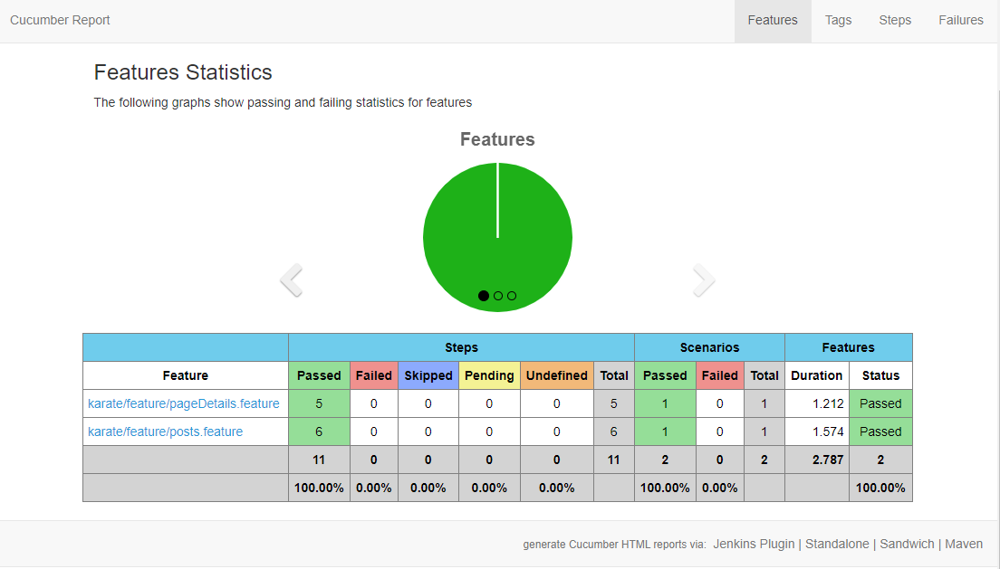

# Integration tests

## About

Module which consists of integration test for:
 
* webservices checking based on [Karate Framework](https://github.com/intuit/karate),
* web page HTML markup checking based on [JUnit5](https://junit.org/junit5) & [JSoup](https://jsoup.org).

## Running

To run tests use commands for:

* all tests: `sh gradlew :test:integration:test`. 
* specific Karate feature: `sh gradlew :test:integration:test -i -Pkarate.options='classpath:karate/feature/pageDetails.feature'`

Optionally consider properties for:

* different host / base URL: `-Ptest.publishUrl=http://aem-host.com`,
* running Karate features in parallel: `-Ptest.parallel` with auto-generating [Cucumber Reports](https://github.com/damianszczepanik/cucumber-reporting) under directory *build/cucumber-html-reports*.

## Screenshots

