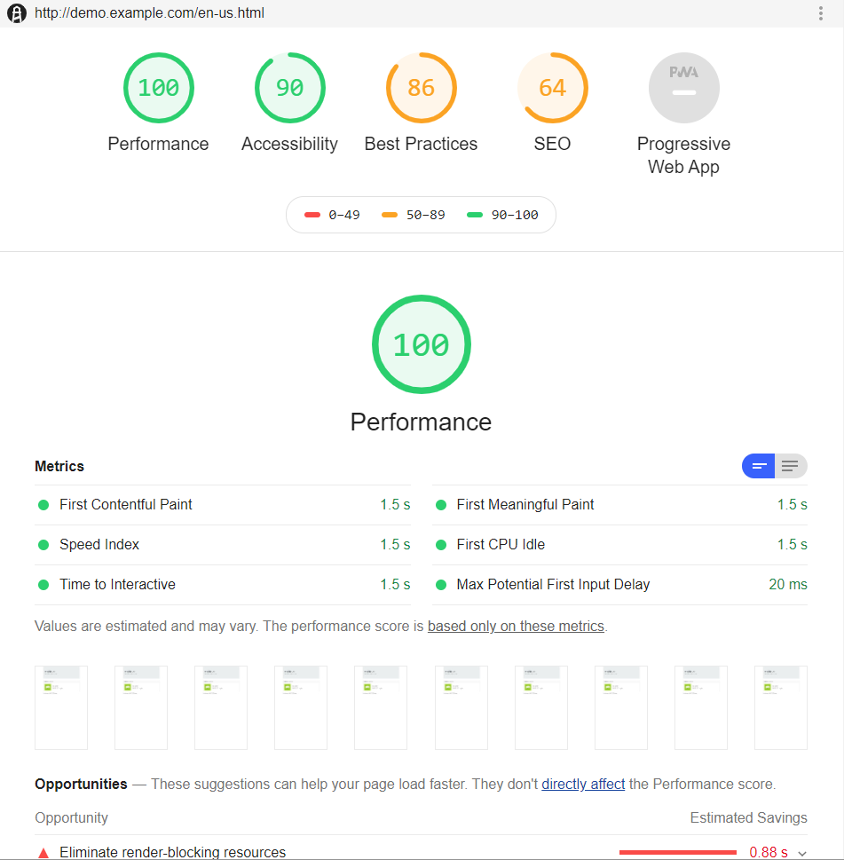

# Performance tests

## About

Tests are based on [Gradle Lighthouse Plugin](https://github.com/wttech/gradle-lighthouse-plugin) / [Lighthouse](https://developers.google.com/web/tools/lighthouse/) tool .

## Configuration

See available configuration options on [plugin page](https://github.com/wttech/gradle-lighthouse-plugin#configuration).

## Running

Simply run command: `sh gradlew :test:performance:lighthouseRun`. 
Optionally configure with `-Ptest.publishUrl=http://aem-host.com` to run tests on other host (using default paths).

Test reports will be saved in `build/lighthouse` directory. 
For each url tested within suite, separate HTML report will be generated.

## Screenshots

